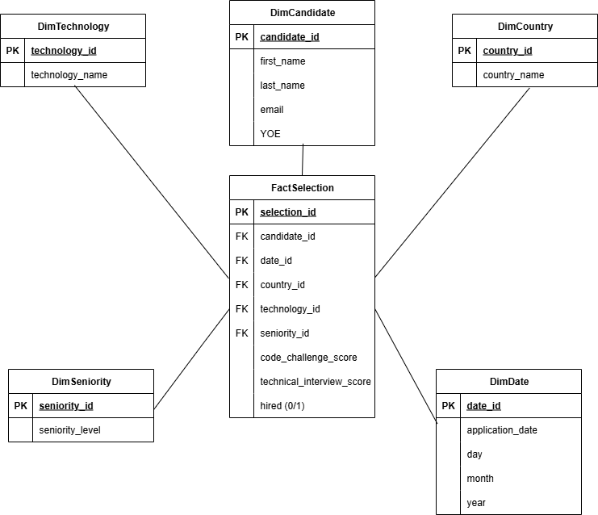

# Workshop 1 - ETL Data Engineer

## Descripción

Este proyecto corresponde al **Workshop 1** del curso **ETL (G01)** del programa de **Ingeniería de Datos e Inteligencia Artificial**.  
Simula un reto real de entrevista técnica para un rol de **Data Engineer**, implementando un proceso ETL completo:

1. **Extract** → Lectura de un dataset de candidatos desde un archivo CSV.  
2. **Transform** → Limpieza, validación, reglas de negocio (regla *HIRED*), y construcción de un **modelo dimensional (esquema en estrella)**.  
3. **Load** → Carga de las tablas resultantes a un **Data Warehouse en MySQL**.  
4. **Reporting** → Cálculo de **KPIs** y generación de reportes a partir del DW (no directamente desde el CSV).  

---

## Modelo Dimensional (Star Schema)



El esquema está conformado por una tabla de hechos (`fact_selection`) y cinco tablas de dimensiones (`dim_candidate`, `dim_technology`, `dim_country`, `dim_seniority`, `dim_date`).  

**Tabla de Hechos: FactSelection**  
Es el núcleo del modelo y contiene los eventos de cada proceso de selección. Incluye las siguientes métricas y claves foráneas:  

- **Métricas:**  
  - `code_challenge_score` (puntaje de prueba técnica).  
  - `technical_interview_score` (puntaje de entrevista técnica).  
  - `hired (0/1)` (indicador de contratación).  

- **Claves foráneas:** permiten vincular el hecho con las dimensiones (candidato, fecha, país, tecnología, seniority).  

Esta tabla permite calcular KPIs como:  
- Tasa de contratación (*hire rate*).  
- Contrataciones por tecnología, país, seniority o año.  
- Promedio de puntajes en pruebas y entrevistas.  

**Tablas de Dimensiones:**  
- **DimCandidate:** atributos del candidato (nombre, apellido, email, años de experiencia). Permite segmentar por perfil de aspirante.  
- **DimTechnology:** registra tecnologías evaluadas y permite medir demanda y tasa de éxito por stack.  
- **DimCountry:** almacena países de procedencia de candidatos y soporta comparaciones internacionales.  
- **DimSeniority:** define nivel de experiencia (Junior, Semi-Senior, Senior), útil para analizar tasas de contratación según seniority.  
- **DimDate:** contiene la fecha de postulación con día, mes y año, fundamental para el análisis temporal de contrataciones.  

**Justificación del Modelo:**  
El diseño responde a los principios de un esquema estrella, ampliamente utilizado en Data Warehousing por su simplicidad y eficiencia:  

- **Claridad Analítica:** separa métricas (hechos) de descripciones contextuales (dimensiones).  
- **Escalabilidad:** permite agregar nuevas dimensiones (ej. fuente de reclutamiento) sin rediseñar toda la estructura.  
- **Rendimiento:** optimiza consultas frecuentes de agregación y filtros para KPIs.  
- **Reusabilidad:** cada dimensión puede ser compartida si en el futuro se amplían los procesos de negocio en el DW.  

---

## ETL Pipeline

### 1. Extract
- Archivo de entrada: `data/candidates.csv` (50k registros).  
- Exploración inicial en `notebook/eda.ipynb` (validación de nulos, duplicados, emails inválidos, etc.).

### 2. Transform
- Implementado en `src/ETL/transform.py`.  
- Reglas aplicadas:
  - Columna **`hired`**: un candidato es considerado contratado si `Code Challenge Score ≥ 7` y `Technical Interview Score ≥ 7`.  
  - Creación de dimensiones y llaves primarias.  
  - Generación de la tabla de hechos `fact_selection`.  

### 3. Load
- Implementado en `src/ETL/load.py`.  
- Carga automática en **MySQL Workbench** (`selection_dw`):  
  - Creación de base de datos `selection_dw` en MySQL.  
  - Inserción de registros usando `mysql-connector-python`.  

### 4. KPIs & Reporting
- Implementados en `src/ETL/kpis.py`.  
- Métricas calculadas:  
  1. **Hiring Rate (% de contratación).**  
  2. **Promedio de puntajes (challenge e interview) por seniority.**  
  3. **Contrataciones por tecnología.**  
  4. **Contrataciones por año.**  
  5. **Contrataciones por seniority.**  
  6. **Contrataciones por país a lo largo de los años** (foco: USA, Brasil, Colombia, Ecuador).  

---

## Estructura del Repositorio

## 📂 Estructura del Repositorio

```bash
WORKSHOP1/
│── data/
│   └── candidates.csv          # Dataset original
│── notebook/
│   └── eda.ipynb               # Exploración inicial (EDA)
│── src/
│   └── ETL/
│       ├── transform.py        # Transformación y creación de modelo dimensional
│       ├── load.py             # Carga a MySQL DW
│       ├── kpis.py             # Consultas SQL y KPIs
│       └── main.py             # Orquestación ETL (Extract → Transform → Load)
│── requirements.txt            # Librerías necesarias
```

## 🛠️ Tecnologías Utilizadas

- **Jupyter Notebook** → Análisis exploratorio (EDA).
- **Python** (3.x)  
  - `pandas`, `numpy` → Transformación de datos.  
  - `mysql-connector-python` → Conexión a MySQL.      
- **MySQL Workbench** → Data Warehouse (DW).  
- **Power BI** → Visualización de KPIs e informes interactivos.  

## Decisiones Clave / Justificación

- **Uso de esquema en estrella:**  
  Elegí un **Star Schema** porque es el más utilizado en entornos de analítica empresarial. Permite consultas rápidas y fáciles de entender para usuarios de negocio, al mismo tiempo que simplifica la integración de múltiples dimensiones (candidato, fecha, país, tecnología, seniority) en torno a una tabla de hechos centralizada.  

- **Elección de MySQL Workbench como Data Warehouse:**  
  Seleccioné **MySQL** porque es un gestor de bases de datos ampliamente usado en la industria, ligero y compatible con Python mediante `mysql-connector-python`. Esto facilita la replicación del proyecto en distintos entornos sin depender de soluciones propietarias más complejas.  

- **Selección de KPIs:**  
  Los KPIs elegidos reflejan indicadores estratégicos de un proceso de selección:  
  - **Hiring Rate:** mide la eficiencia global del proceso.  
  - **Promedio de puntajes por seniority:** muestra calidad del talento contratado.  
  - **Contrataciones por tecnología, seniority y país:** aportan una visión comparativa útil para la toma de decisiones en reclutamiento.  
  - **Contrataciones por año:** permite analizar tendencias históricas.  

---

## Instalación y Ejecución

1. Clonar el repositorio:  
   ```bash
   git clone https://github.com/Mariana-Cifuentes/Workshop1.git
   cd WORKSHOP1
   ```
2. Crear entorno virtual e instalar dependencias:  
   ```bash
   python -m venv venv
   source venv/bin/activate   # Linux/Mac
   venv\Scripts\activate      # Windows
   pip install -r requirements.txt

3. Configurar MySQL Workbench:

   * Crear base de datos `selection_dw`.
   * Ajustar credenciales en `src/ETL/main.py` y `src/ETL/kpis.py` (host, user, password).

4. Ejecutar el pipeline ETL completo:

   ```bash
   python src/ETL/main.py
   ```

5. Consultar KPIs:

   ```bash
   python src/ETL/kpis.py
   ```

---

## Resultados

Los KPIs permiten analizar la efectividad del proceso de selección:

* Distribución de contrataciones por **tecnología, seniority, país y año**.
* Porcentaje total de contratación (**Hiring Rate**).
* Promedio de puntajes de candidatos contratados por **seniority**.

Esto proporciona una **visión estratégica** de cómo evoluciona el proceso de contratación en diferentes contextos.

---

## Visualizaciones (Power BI)

Se diseñó un **dashboard en Power BI** conectado al Data Warehouse en MySQL, que permite analizar los KPIs definidos en el proyecto.


[Ver Dashboard en línea](https://app.powerbi.com/groups/me/reports/fdfa3a94-378a-4fd5-a866-0af8d9ddfd82/18b7e5a9665e905b2b7a?ctid=693cbea0-4ef9-4254-8977-76e05cb5f556&experience=power-bi)

